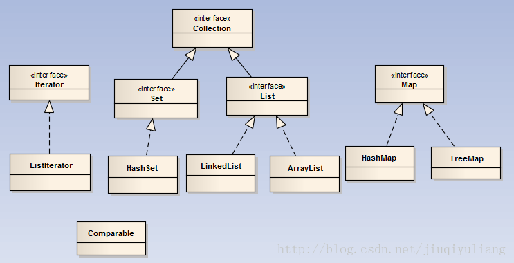
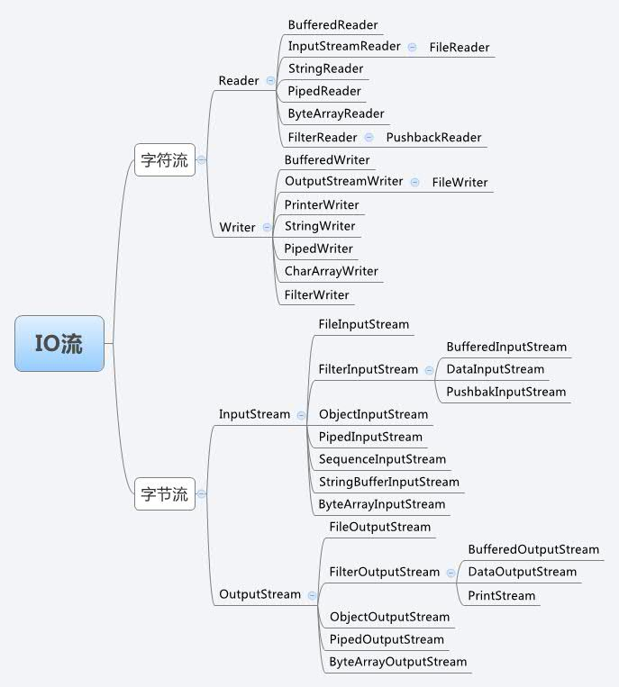

# day02
> Java基础课

---

## 今日大纲
#### 字符串
#### 泛型
#### 集合
#### I/O
#### 反射
#### 总结
#### 作业

---

## 字符串

#### 定义
* 看看人家长啥样
    - String str = "哎呀我去!";

#### String常用的方法
* ==与equals ???

#### StringBuilder & StringBuffer
* 使用场景

#### 常见面试题
* String & StringBuilder & StringBuffer 区别

#### 练习题
* 给定一个字符串，判断其是否回文（即正反都一样）

---

## 泛型

#### 出现的意义
* 为编码阶段的不确定性和转化做视觉设计
* 将运行期遇到的问题转移到了编译期，省去了强转的麻烦

#### 定义
* 静态
* 非静态

#### 使用示例
* 通用的数据包装类
* 静态工厂方法
* Pair

---

## 集合

#### 集合的意义
* 当我们想操作一批相同的对象时，我们在方法中传递，总不能一个个传递，就比如我要给你10个篮球，我家距离你家500米，我一定是找个袋子，或者篮子，或者xxxx把篮球装起来，一起给你送过去
* 这就是集合的一个意义

#### 用数组不可以吗？
* 数组当然可以，但是数组有个问题就是一旦申请空间，大小就固定了，我不见得每次都给你送固定个数的篮球，万一是100个呢，要是100000个呢，数组还有个问题就是空间需连续，我没有这么大的一整块的空间呀
* 而集合，可变

#### 看看集合家族史
* 看完之后，会觉得神清气爽。。。喜欢看源码的可以走起来了~~~



#### 各个集合类的区别
* List
    - ArrayList： 数组实现，线程不安全，查询速度快
    - LinkedList： 链表结构，增删速度快
* Set
    - HashSet：线程不安全，存取速度快。那么其唯一性是如何保证的？
    - TreeSet：线程不安全，可以对Set集合中的 元素进行排序。如何保证的顺序？
* Vector：线程安全，但速度慢，已被 ArrayList替代，不在建议使用

#### 常用方法
* List
* Set

#### Map
* Map并不在Collection体系中，一般喜欢放在一起讲
* Map的结构
    - k1 -> [x,x,x]
    -        1 
    -      2  2
* 常用方法
    - put
    - get

#### 练习题
* 1.判断两个集合是否有相同元素，若有则输出相同的元素
* 2.给定一个HashSet，排序其中元素，输出

---

## I/O

#### IO体系



#### 文件读取
* 从本地磁盘读取文件进内存

#### 文件写出
* 从内存将数据写入到本地磁盘

#### 练习题
* 给定路径后完成文件的复制

#### 文件读写常用方式: 缓冲流
* Buffered*

#### 常见面试题
* 字节流有字符流的区别?
* Java中IO流分为几种?


---

## 反射

#### 反射的目的
* 神奇的小XX

#### 反射的能力
* class
* method
* field
* constructor

#### 

---

## 总结

#### 今日主要内容

---

## 作业

#### 从文件读取数据，解析出来之后，存入至数据库中
* 文件内容诸如: id, name, age是一种格式表示，用逗号分隔
```java
id, name, age
1,   jim,  23
2,   jack, 24
```
* 表结构设计请自行思考,可以基于文件内容设计，如: id,name,age

#### 给定一个字符串，判断其是否回文
* 回文: 即正反都一样

#### 集合作业题
* 1.判断两个集合是否有相同元素，若有则输出相同的元素
* 2.给定一个HashSet，排序其中元素，输出

#### IO作业题
* 给定路径后完成文件的复制
