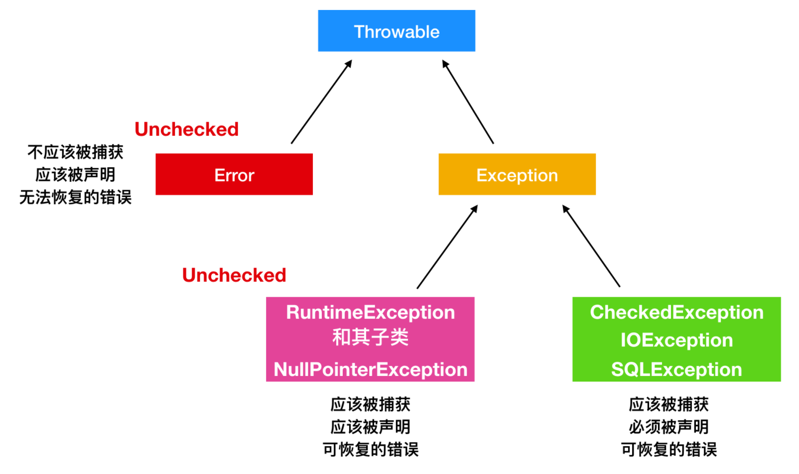
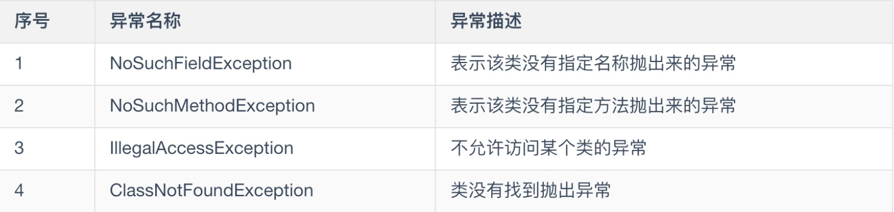
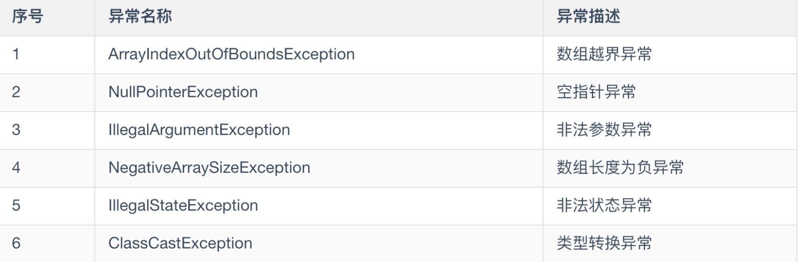
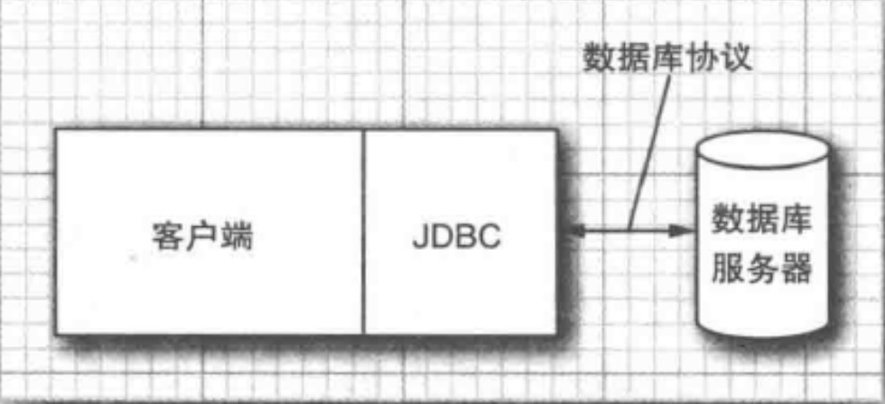
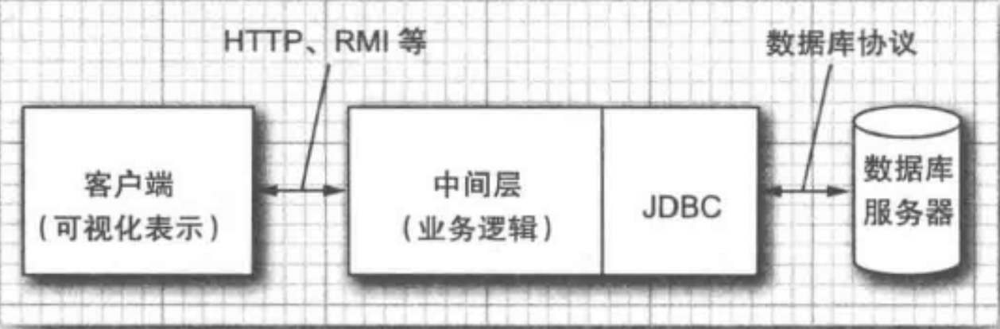
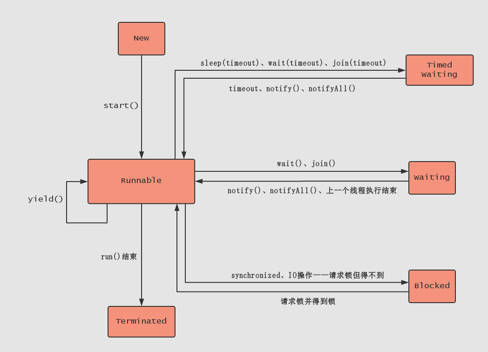
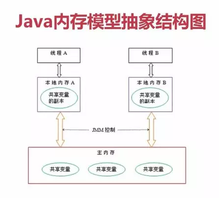
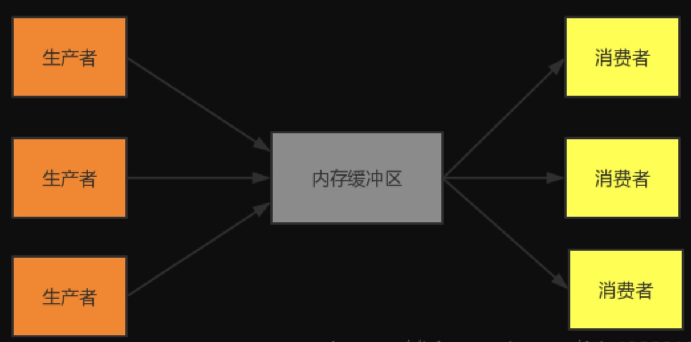

# day03
> Java基础课

---

##  今日大纲

#### 异常

#### JDBC

#### 多线程

#### Java8

#### 总结

#### 资料

#### 作业

---

## 异常

#### 异常是什么？
* 程序运行时有着太多的不确定性，比如写好一段读取文件的程序，下一次运行时文件被人给删除了。程序要第一时间给程序员这个文件不存在的消息。这个因为不确定性而导致程序无法运行时给出的消息，就是我们所说的异常。
* Java中万事万物皆对象，因此这个异常消息，也被Java定义成了对象(Exception)

#### 异常体系图


#### 异常分类
* 受检异常。。。。啥含义？
* 运行时异常。。。啥含义？

#### 异常常见方法
* getMessage()
    - 返回抛出异常的详细信息
* printStackTrace()
    - 打印异常信息到标准输出流上

#### 常见受检异常


#### 常见运行时异常



#### try-catch-finally
* 代码块

---

## JDBC

#### JDBC是啥？
* jdbc是一套API，是一套操作数据库的标准类库
* 为了统一操作各个厂商的数据库，而制定的一套标准
* 有了这样一套标准之后，数据库厂商提供实现，即可完成对应的操作

#### JDBC用法




#### JDBC示例(以MySQL为例)
* 添加MySQL驱动
    - compile('mysql:mysql-connector-java:8.0.20')
* 新建测试表
```sql
CREATE DATABASE IF NOT EXISTS course DEFAULT CHARSET utf8mb4;

USE course;

SET NAMES utf8mb4;

—- 用户表
CREATE TABLE IF NOT EXISTS `tb_user`
(
    `id`          BIGINT(20) UNSIGNED NOT NULL AUTO_INCREMENT COMMENT '自增主键',
    `name`        VARCHAR(64)         NOT NULL DEFAULT '' COMMENT '用户名字',
    `age`         INT                 NOT NULL DEFAULT 0  COMMENT '年纪',
    PRIMARY KEY (`id`)
) ENGINE = InnoDB DEFAULT CHARSET = utf8mb4 COMMENT ='用户表';

-- 测试数据
insert into `tb_user`(`name`,`age`) values('张三',23);
```
* 示例代码
```java
// course.basic.jdbc.Demo1
public class Demo1 {

    public static void main(String[] args) throws SQLException, ClassNotFoundException {
        String url = "jdbc:mysql://127.0.0.1:3306/course";
        String userName = "root";
        String password = "123456";

        Connection connection = DriverManager.getConnection(url, userName, password);
        PreparedStatement statement = connection.prepareStatement("select * from tb_user");
        ResultSet resultSet = statement.executeQuery();

        while (resultSet.next()) {
            String name = resultSet.getString("name");
            int age = resultSet.getInt("age");
            System.out.println("name=" + name + ", age=" + age);
        }

        resultSet.close();
        statement.close();
        connection.close();
    }
}
```

#### JDBC操作流程
* 建立连接
* 执行sql
* 解析结果
* 关闭资源

#### 增删改查(CRUD)
* insert
* update
* delete
* select

#### 对查询做一个小小的设计
* 将user 抽象出 对象实体

---

## 多线程

#### 线程是什么？
* 进程: 程序运行时一块独立的内存空间
* 线程: 内存中最小的执行单元

#### 为什么要多线程？
* 进程之间调度起来，上下文切换，保留程序执行信息等，比较消耗资源，无法为多核CPU提供很好的支持
* 因此有了多线程，线程为CPU执行的单元，在切换时成本大大降低
* 注: 线程，进程 是计算机本身的概念。不是Java语言所特有的能力，其他语言也一样具有此能力

#### 线程在Java中长什么样？
* Java是面向对象编程语言，所以Java将任何事物都抽象出了对象，线程也一样。
* 在Java中线程类=Thread

#### 新建个运行的线程
* Thread thread = new Thread(); // 新建
* thread.start();               // 启动

#### 线程的生命周期


#### 面试题1
* Java中wait()和sleep()方法的不同?
    - 最大的不同是在等待时wait()会释放锁,而sleep()一直持有锁。
    - wait()通常被用于线程间交互,sleep()通常被用于暂停执行

#### Runnable接口
* 市面都说这也是新建线程的方法之一，真的对吗？
* 思考之前课程内容。。。。

#### Java内存模型
* 线程间共享了数据之后会发生什么？



#### 线程安全问题
* 由于内存数据的模型问题，导致多线程之间共享数据时会出现差异
* 代码示例1

#### Thread常用方法
* start()
    - 线程调用该方法将启动线程，使之从新建状态进入就绪队列排队，一旦轮到它来享用CPU资源时，就可以脱离创建它的线程独立开始自己的生命周期了
* run()
    - Thread类的run()方法与Runnable接口中的run()方法的功能和作用相同，都用来定义线程对象被调度之后所执行的操作，都是系统自动调用而用户程序不得引用的方法
* sleep(int millsecond)
    - 优先级高的线程可以在它的run()方法中调用sleep方法来使自己放弃CPU资源，休眠一段时间
* isAlive()
    - 线程处于“新建”状态时，线程调用isAlive()方法返回false。在线程的run()方法结束之前，即没有进入死亡状态之前，线程调用isAlive()方法返回true
* currentThread()
    - 该方法是Thread类中的类方法，可以用类名调用，该方法返回当前正在使用CPU资源的线程
* interrupt()
    - 一个占有CPU资源的线程可以让休眠的线程调用interrupt()方法“吵醒”自己，即导致休眠的线程发生InterruptedException异常，从而结束休眠，重新排队等待CPU资源。
* join()
    - 作用是等待线程对象销毁
    - 主线程创建并启动了线程，如果子线程中要进行大量耗时运算，主线程往往将早于子线程结束之前结束。这时，如果主线程想等待子线程执行完成之后再结束，比如子线程处理一个数据，主线程要取得这个数据中的值，就要用到join()方法了。方法join()的作用是等待线程对象销毁
* yield()
    - 暂停当前正在执行的线程对象，并执行其他线程
* setDaemon(boolean on)
    - 设置为后台线程

---

## Java8

#### Java8是什么
* 其实不是啥新技术，就是jdk1.8*的一种说法
* 因为其新特性具有创造性改变，故此Java8成了一种新技术一样

#### Lambda表达式
* 函数式接口
* 

#### Stream流化
* 将集合流化
    - xxx.stream()         // 创建普通流
    - xxx.parallelStream() // 创建并行流
* 数组类支持
    - Arrays.stream()

#### Stream案例实操
* 示例1
```java
List<String> myList =
    Arrays.asList("a1", "a2", "b1", "c2", "c1");

myList
    .stream()
    .filter(s -> s.startsWith("c"))
    .map(String::toUpperCase)
    .sorted()
    .forEach(System.out::println);
```

* 示例2
```java
Stream.of("one", "two", "three", "four")
                .filter(e -> e.length() > 3)
                .peek(e -> System.out.println("Filtered value: " + e))
                .map(String::toUpperCase)
                .peek(e -> System.out.println("Mapped value: " + e))
                .collect(Collectors.toList());
```

* 示例3: 找出全文的单词，转小写，并排序
```java
public static void main(String[] args) throws IOException {
    String path = "/Users/haoc/course/code/cakes-course/basic/src/main/java/course/basic/App.java";
    BufferedReader br = new BufferedReader(new FileReader(path));
    List<String> words = br.lines()
            .flatMap(line -> Stream.of(line.split(" ")))
            .filter(word -> word.length() > 0)
            .map(String::toLowerCase)
            .distinct()
            .sorted()
            .collect(Collectors.toList());
    br.close();
    words.forEach(System.out::println);
}
```

* 示例4
```java
public static void main(String[] args) throws IOException {
    List<Person> persionList = new ArrayList<Person>();
    persionList.add(new Person(1, "张三", "男", 38));
    persionList.add(new Person(2, "小小", "女", 2));
    persionList.add(new Person(3, "李四", "男", 65));
    persionList.add(new Person(4, "王五", "女", 20));
    persionList.add(new Person(5, "赵六", "男", 38));
    persionList.add(new Person(6, "大大", "男", 65));

    //1、只取出该集合中所有姓名组成一个新集合
    List<String> nameList = persionList.stream().map(Person::getName).collect(Collectors.toList());
    System.out.println(nameList.toString());

    //2、只取出该集合中所有id组成一个新集合
    List<Integer> idList = persionList.stream().mapToInt(Person::getId).boxed().collect(Collectors.toList());
    System.out.println(idList.toString());

    //3、list转map，key值为id，value为Person对象
    Map<Integer, Person> personmap = persionList.stream().collect(Collectors.toMap(Person::getId, person -> person));
    System.out.println(personmap.toString());

    //4、list转map，key值为id，value为name
    Map<Integer, String> namemap = persionList.stream().collect(Collectors.toMap(Person::getId, Person::getName));
    System.out.println(namemap.toString());

    //5、进行map集合存放，key为age值 value为Person对象 它会把相同age的对象放到一个集合中
    Map<Integer, List<Person>> ageMap = persionList.stream().collect(Collectors.groupingBy(Person::getAge));
    System.out.println(ageMap.toString());

    //6、获取最小年龄
    int ageMin = persionList.stream().mapToInt(Person::getAge).min().getAsInt();
    System.out.println("最小年龄为: " + ageMin);

    //7、获取最大年龄
    int ageMax = persionList.stream().mapToInt(Person::getAge).max().getAsInt();
    System.out.println("最大年龄为: " + ageMax);

    //8、集合年龄属性求和
    int ageAmount = persionList.stream().mapToInt(Person::getAge).sum();
    System.out.println("年龄总和为: " + ageAmount);


    //9、查找年龄大于20岁的人数
    long age = persionList.stream().filter(p -> p.getAge() > 20).count();
    System.out.println(age);

    //10、查找年龄大于20岁，性别为男的人数
    List<Person> ageList = persionList.stream().filter(p -> p.getAge() > 20).filter(p -> "男".equals(p.getSex())).collect(Collectors.toList());
    System.out.println(ageList.size());
}

static class Person {
    int id;
    String name;
    String sex;
    int age;

    public Person(int id, String name, String sex, int age) {
        this.id = id;
        this.name = name;
        this.sex = sex;
        this.age = age;
    }

    public int getId() {
        return id;
    }

    public String getName() {
        return name;
    }

    public String getSex() {
        return sex;
    }

    public int getAge() {
        return age;
    }
}
```


---

## 总结

#### 今日重点
* 都是重点

#### 需要多加练习
* Java8 Stream
* JDBC 增删改查

---

## 资料

[Java并发编程实战](https://book.douban.com/subject/10484692/)

[Java 8实战](https://book.douban.com/subject/26772632/)

[Java 8 教程汇总](https://legacy.gitbook.com/book/wizardforcel/java8-tutorials/details)

---

## 作业

#### 题1
* 用Java代码来编写生产者—消费者模式; wait(), notify()



#### 题2
* 本地创建一个文件 ，内容格式为每行:id,name,age
    - 如: 1, 张三, 23
* 解析此文件，解析后将内容存储进数据库。自行建数据库，表等
* 附加能力: 
    - 对数据做去重处理，即id,name,age三个数据完全一样认为是相同的
    - 对数据排序,将数据排序后存储进数据库

#### 题3
* 给定数据列表List<Stu>
* Stu属性
    - id,name,age,className
* 流化操作: 过滤stu.className==一班 -> 去重 -> 基于年纪排序 -> 返回最新列表


