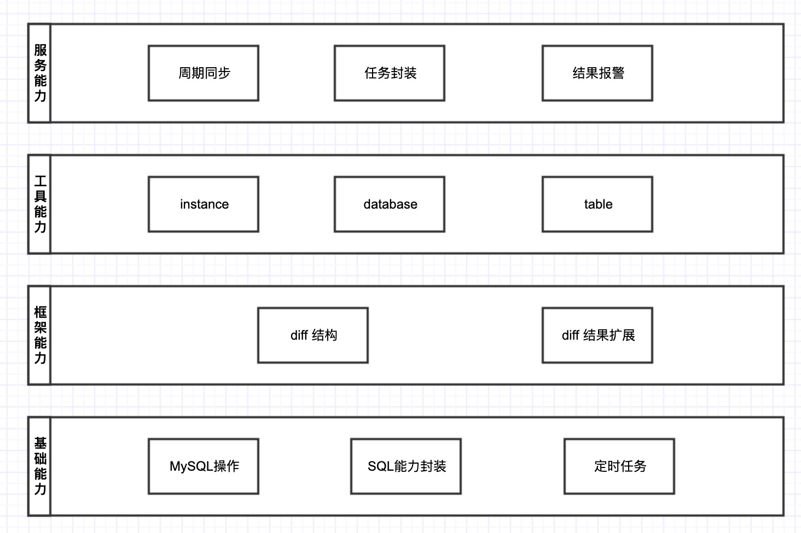

# day08-09
> mysql schema sync tools no.1

---

## MySQL Schema Sync 工具概述
#### 场景
* 线下测试
* 组内有5+QA
* 线下环境>2,或人手一套自己的测试环境
* 业务处于发展中，SQL变更还算较频繁，几乎每次业务变更都有与SQL相关的改动
* 线下环境的部署均靠个人维护，有成熟部署工具，依赖持续集成

#### 常规解决
* 流程约定
    - 约定组内qa跟进开发项目迭代，如果有SQL变更则将其变更同步至所有测试环境
    - 问题是? 约定如果不靠谱？ QA忘了做？ 开发未与QA同步变更？
* SQL变更平台自动同步
    - 与DBA沟通，在开发提交SQL变更时，一并同步多套测试环境
    - 问题是？DBA不支持，环境不互通无法操作？测试环境变化频繁？
* 你们的方案是？

#### 思考
* 针对qa自己解决的场景里，我们如果是后置得到SQL未更新时，一般处理套路如下:
    - 更新代码后，运行程序，发现有报错。开始进行排查
    - 排查时可能并不能一下就知道具体是哪个模块出的问题，因此可能要从上到下逐个排查
    - 排到具体模块确定是SQL问题时
        + 查看报错字段
        + 查看约定SQL文件
        + 查看DBA SQL审核平台的提交记录
        + 找出确定字段，编写脚本来变更，线下库为分表1024张
        + 编写for循环shell脚本去依次执行
    - 计算本次变更操作的时间
* 这个过程有难度？ 错，毫无难度，这个过程复杂？ 错，一般都不复杂
    - 问题出在哪？ 作为QA这样的场景执行2次亲身感受下就够了
    - 假设一年的时间里，你一直再重复这样的事情，那么不是你所在环境的问题，是你个人的问题
* 思考解决

#### 解决方案调研
* https://github.com/hidu/mysql-schema-sync
    - Go语言实现
* https://github.com/mmatuson/SchemaSync
    - Python语言实现
    
---

## MySQL Schema Sync 工具设计

#### 基本设计方案
* 纯Java语言实现，web服务对外提供统一能力输出
* SpringBoot作为基础框架实现

#### 实现思路
* MySQL结构同步，同步即有源，有目标，因此需要拿到两个实例的连接，然后做同步
* 如何对源和目的做对比来diff出差异？即基于两个实例的information_schema库相关的记录进行对比

#### 同步的目标
* 库同步
* 表同步
* 字段同步
* 索引同步
* 存储过程???

---

## information_schema库
#### TABLES, 数据库中的表的信息
* TABLE_SCHEMA: 数据库名
* TABLE_NAME : 表名
* ENGINE : 引擎
* TABLE_ROWS : 表的行数
* DATA_LENGTH: 记录表的大小
* INDEX_LENGTH : 记录表的索引大小

#### COLUMNS, 表中的列信息(部分)
* TABLE_SCHEMA: 数据库名
* TABLE_NAME: 表名
* COLUMN_NAME: 列名
* COLUMN_KEY: 列对应索引类型 PRI,MUL
* COLUMN_TYPE: 列的数据类型 char varchar int bigint
* COLUMN_COMMENT: 注释信息
* DATA_TYPE: 列数据类型
* COLUMN_DEFAULT:列中默认值
* CHARACTER_SET_NAME: 数据库对应字符列默认字符编码, utf8
* IS_NULLABLE: 是否为null
* NUMERIC_PRECISION: 列中数字长度(整数部分)
* NUMERIC_SCALE: 列中数字长度(浮点数部分)

#### SCHEMATA, 数据库的信息(部分)
* SCHEMA_NAME: 数据库名
* DEFAULT_CHARACTER_SET_NAME : 默认字符集

#### STATISTICS, 表索引的信息(部分)
* TABLE_SCHEMA: 数据库名
* TABLE_NAME: 表名
* INDEX_NAME: 索引名
* SEQ_IN_INDEX: 字段在索引中的顺序
* COLUMN_NAME: 字段名

---

## 环境搭建

#### 基于docker新建三个MySQL示例
* 端口: 3306
```shell
> docker run -p 3306:3306  --restart=always  --privileged=true --name mysql5.7.22 -e MYSQL_ROOT_PASSWORD="123456" -d mysql:5.7.22
```

* 端口: 3388
```shell
> docker run -p 3388:3306  --restart=always  --privileged=true --name mysql5.7.22-new -e MYSQL_ROOT_PASSWORD="123456" -d mysql:5.7.22
```

* 端口: 3399
```shell
> docker run -p 3399:3306  --restart=always  --privileged=true --name mysql5.7.22-nnn -e MYSQL_ROOT_PASSWORD="123456" -d mysql:5.7.22
```

#### 新建测试SQL表
* 账户表
```sql
--- 账户表
create table if not exists `tb_account`(
    `id`          BIGINT(20) UNSIGNED NOT NULL AUTO_INCREMENT COMMENT '自增主键',
    `ant_id`      VARCHAR(64)         NOT NULL DEFAULT '' COMMENT 'account id',
    `ant_name`    VARCHAR(64)         NOT NULL DEFAULT '' COMMENT '账户名称',
    `balance`     BIGINT(20)          NOT NULL DEFAULT 0  COMMENT '账户余额',
    PRIMARY KEY (`id`),
    UNIQUE KEY `uniq_ant_id` (`act_id`)
) ENGINE = InnoDB DEFAULT CHARSET = utf8mb4 COMMENT ='账户表';
```
* 用户表
```sql
--- 用户表
create table if not exists `tb_user`(
    `id`          BIGINT(20) UNSIGNED NOT NULL AUTO_INCREMENT COMMENT '自增主键',
    `user_id`     VARCHAR(64)         NOT NULL DEFAULT '' COMMENT '唯一id',
    `user_name`   VARCHAR(64)         NOT NULL DEFAULT '' COMMENT '用户名',
    `email`    	  VARCHAR(128)        NOT NULL DEFAULT '' COMMENT '邮件',
    `address`     VARCHAR(256)        NOT NULL DEFAULT '' COMMENT '地址',
    `corp`        VARCHAR(64)         NOT NULL DEFAULT '' COMMENT '公司',
    PRIMARY KEY (`id`),
    UNIQUE KEY `uniq_user_id` (`user_id`),
    KEY	`idx_user_name`(`user_name`)
) ENGINE = InnoDB DEFAULT CHARSET = utf8mb4 COMMENT ='用户表';
```

---

## 编码实现

#### 请求接收
* api

#### 请求分析
* sync
* diff

#### 请求处理
* 执行sync
* 执行diff

#### MySQL交互
* 操作MySQL

#### 相关依赖
```groovy
implementation('mysql:mysql-connector-java:8.0.20')
implementation('org.mybatis:mybatis:3.5.5')
implementation('com.alibaba:druid:1.1.22')
```

---

## 总结

#### 系统的分层
* 基础
    - 常用的工具类
        + ListUtils
        + SqlUtils
        + 
    - 就是封装各种db层的操作
        + show create table xxxx
        + show create database xxxx
        + exec batch sql
        + exec sql
* 框架
    - 比如 Spring,MyBatis,SpringBoot 
    - 对比 mysql-schema-sync
    - 我们的框架到底做了什么？ ==》 核心能力: table diff, database diff, instance diff
    - 扩展能力: 基于diff 生成SQL | 输出差异信息=》报警 
* 工具
    - 就是我们抽象出来一个场景的使用。
    - 比如: 线下环境有多套，每个人在执行测试时修改SQL，互相之间需要靠人工的传递消息。
    - 盲目的去做对比分析，并执行差异结构的同步。
    - controller: /sync/instance, /sync/database, /sync/table
* 服务
    - 对外提供的一种能力。或几种能力的集合。
    - 除了刚提到的工具之外，将与我们的框架能力进行最大化的扩展和设计
    - 在框架层面向外输出对应的能力。
    - 刚描述的，比如 基于差异结果做diff sql输出，然后交给用户去做判断处理，是否要执行，以及执行之后的结果，以通知的形式发出，报警。。。。
    - 基于 scheduler 配置，一个源，多个目的。在周期时间内，进行自动化的对比，未每个配置添加提醒人，  发给提醒人之后，我们带着一个链接+id, 让提醒人来选择是否要执行。如果对方确定，我们就完成此差异的执行。否则，就不管了。
    - 一般会以 SpringBoot为载体启一个进程的形式来承载我们说的”服务“的能力。
    - 与框架或工具不同的是，作为服务时，其能力是可以做扩展的。 
    - 微服务 -> 云 | SpringBoot/SpringCloud
* 需求
    - 指定库的同步
    - 指定同步结果的输出方式， 生成SQL，报警提示
    - 定时周期运行，并最终以任务形式给到用户做确认。

#### 系统的分层-图书



